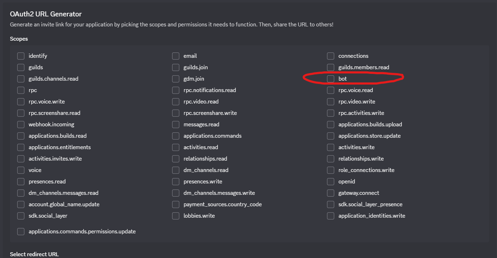
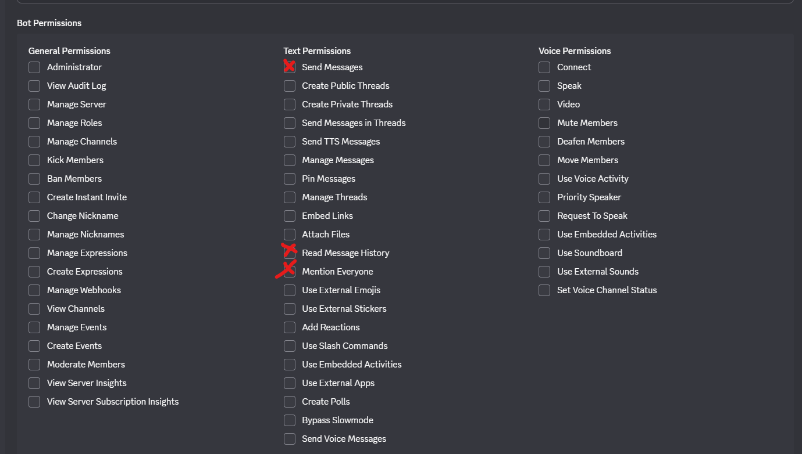

# ARK Raid Alert Bot

This is a Discord bot that watches an ARK tribe log channel and sends alerts when a tek sensor message is detected and or a structure is destroyed.

It looks for messages that contain certain words and patterns so you can always be on high alert while using tribelog hook.

Have fun with sleepless nights :)

---

## Features:
###### (If both features are disabled the bot just stops.)
### Tek Sensor detection(Toggleable):

- Detects raid alerts from ARK tribe logs
- Extracts the base location (for example MAINWALL)
- Extracts the attacker type (enemy dino or enemy player)
- Pings a Discord role
- Sends 3 alert messages with the image (prevents missing alerts)
- Keeps a 30 minute rolling raid counter
- Shows danger level using emoji bar (⚠️⚠️⚠️ for low count, 🔥🔥🔥 for medium, 💀💀💀 for high)

### Structure destruction detection (Toggleable):
- Detects when structures are being broken
- Extracts which map
- Extracts who destroyed the structure
- Extracts what is destroyed
- Sends an alert with emoji bar when threshold is reached
- Keeps a 30 minute rolling structure destruction counter
- Only sends a message when the counter reaches or exceeds DESTRUCTION_ALERT_THRESHOLD (defaults to 5)
- Sends the image attachment when 15+ structures have been destroyed

---

## Requirements

- Python 3.10 or newer
- A Discord bot token [Learn how to:](#how-to-create-ur-own-discord-bot-so-this-works)
- The tribe log must be sent into a Discord channel (by another bot tribeloghook ark bot)

---

## Setup

### 1. Install Python packages
```terminal
python -m pip install discord.py python-dotenv
```
---

### 2. Create a .env file

In the same folder as RaidBot.py, create a file named:

.env

Put this inside (replace the numbers with your own):
# DO NOT SHARE YOUR OWN ENV FILE WITH ANYONE!!!!!!!
[Create your discord bot token here](#how-to-create-your-own-discord-bot-so-this-works)
```env 
DISCORD_TOKEN=YOUR_BOT_TOKEN
TRIBE_LOG_CHANNEL_ID=123456789012345678 (Required - Right-click on the TribeLog hook channel and copy the ID)
ALERT_CHANNEL_ID=123456789012345678 (Required - Right-click on the ALERT channel and copy the ID)
TRIBELOG_BOT_ID=123456789012345678 (Required - Right-click on the TribeLog bot in Discord and copy the ID)
ROLE_ID=123456789012345678 (Required - Right-click on the role in Discord and copy the ID)
BASE_MAPS= (Optional - default is empty: if it is empty sends alerts when ANY map is being attacked type any of the island names for it to recognize which island it has to keep watch for: The Island,Abberation,Genesis 2,Genesis 1,Ragnarok,The Center,Valguero,Crystal Isles,Lost Island,etc.. (Comma seperated: TheIsland,Abberation,TheCenter))
DESTRUCTION_ALERT_THRESHOLD=5 (Optional - defaults to 5 if not set)
NOT_MAIN_MAP_DESTRUCTION_THRESHOLD=25 (Optional - defaults to 25 if not set)
DISABLE_NOT_MAIN_MAP_ALERTS=false (false by default turn on true if u dont want to be notified when another map than your BASE_MAP(S) are/is being attacked)
DISABLE_SENSOR_ALERTS=false (Optional - set to 'true' to disable raid alerts)
DISABLE_DESTRUCTION_ALERTS=false (Optional - set to 'true' to disable destruction alerts)
DEBUG=false (Optional - set to true for verbose logs)
```
---

### 3. Add your alert image(or leave this empty for the default one:)

Put a .png image named:

alert.png

in the same folder as the bot.

or use the default:


---

### 4. Run the bot

```python
python RaidBot.py
```

If it works, you should see:

Logged in as ARK Raid Bot

---

## Debugging

Debug mode gives you detailed logs for troubleshooting. You can enable it in two ways:

**Option 1: Using .env file**
Add this to your `.env` file:
```env
DEBUG=true
```

**Option 2: Command line argument**
Run the bot with the `--debug` flag:
```terminal
python RaidBot.py --debug
```

When debug mode is enabled, you'll see:
- Detailed extraction info (maps, locations, destroyed items, raiders)
- Destruction counters
- Full stack traces if errors occur
- Sensor and destruction alert details

---

## How it works

The bot reads every message in the tribe log channel.

If it finds:
```
[2-9 0:20:37][Gen2] <<ALERT>> MAINWALL <<ALERT>></>  triggered by <RichColor Color="0, 0.5, 0.25, 1">by an enemy dino</>.
```
Or something like:
```md
[2-10 22:14:07][Gen2] Arthropluera - Lvl 297 (Tribe of sleebex) destroyed your 'Tek Generator (Locked) '!
```
For the tek sensor it will send:
- A role ping
- The Map (gen2)
- The location (MAINWALL)
- The attacker (enemy dino)
- The raid counter will go up once
- The alert image gets sent.

For the destroyed structures it will send:
- A role ping
- The Map (gen2)
- The Destroyed structure
- The item/dino/player that destroyed it
- The Destroyed counter will go up by 1 (Only sends a message when the counter reaches or exceeds DESTRUCTION_ALERT_THRESHOLD)

---

## Tips

- Make sure the bot role is above the role it is pinging
- Give the bot permission to read messages, send messages, and mention roles
## - Do not upload your .env file to GitHub!!!!!
## - If your token leaks, reset it in the Discord developer portal

---

## Safety

This bot ignores other bots except the tribe log bot you define in the .env file.
This prevents spam loops and false alerts.

---

## How to create your own Discord bot so this works:
### Step 1 – Create the Discord Bot
- Go to: https://discord.com/developers/applications
- Click New Application → name it ARK Raid Bot
- Go to Bot → Add Bot
- Copy the Bot Token (And add this to your .env file)

### Turn on:
Message Content Intent

Server Members Intent

### Step 2 – Invite the bot to your server
- Go to OAuth2 → URL Generator
#### Scopes:
-bot


This opens the next part where you select:
#### Bot permissions:
- Send Messages
- Mention Everyone
- Read Message History
  


Copy the generated link → open it → add to your server.

# Coming soon(DM me on Discord if you want something added: ikkeyannick)

- Nothing really.
  

## License

Use this for personal servers only.
You are responsible for how you use it.